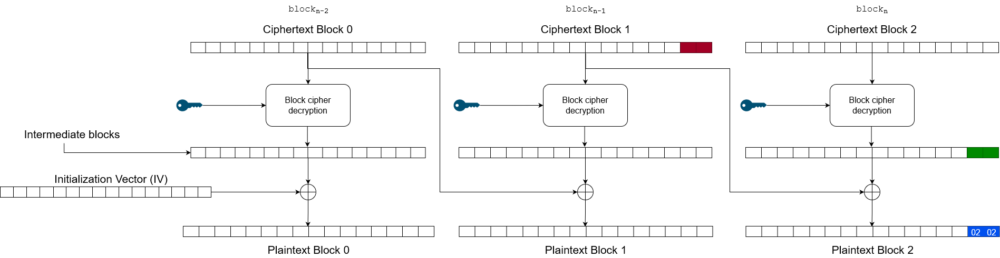

When using AES in CBC mode without any integrity checks such as a MAC, there is a possibility for a padding oracle to occur. For instance, if you have a service that receives encrypted input and informs the user if something went wrong during decryption, then you can view this service as an oracle, because you can "ask" something and get a response to your question. As we learned in [AES Basics](/cryptography/aes_bascis), because AES-CBC is a block cipher and requires a fixed length of 128 bits, the final plaintext block may need extra padding. There exists different padding schemes but the most popular one used is PKCS#7. For example,  if a block needs two more bytes in order to be valid, it will be padded with `\0x2\0x2`. If four bytes are needed, the padding will be `\0x4\0x4\0x4\0x4` and so on. See the table below for more examples *(decimal formatted)*:

```
01
02 02
03 03 03
04 04 04 04
05 05 05 05 05
06 06 06 06 06 06
07 07 07 07 07 07 07
08 08 08 08 08 08 08 08
09 09 09 09 09 09 09 09 09
10 10 10 10 10 10 10 10 10 10
11 11 11 11 11 11 11 11 11 11 11
12 12 12 12 12 12 12 12 12 12 12 12
13 13 13 13 13 13 13 13 13 13 13 13 13
14 14 14 14 14 14 14 14 14 14 14 14 14 14
15 15 15 15 15 15 15 15 15 15 15 15 15 15 15
16 16 16 16 16 16 16 16 16 16 16 16 16 16 16 16 <-- Block full of padding
```

If a ciphertext contains an incorrect padding, the decryption will most likely fail and produce an error. If you can observe this error, either through an error message or measuring response times, then you can *decrypt* a given ciphertext without knowledge about the private key. This is why it is called a padding oracle attack, because you ask the oracle if the padding is correct or not. The next section describes how to perform the attack.

## Performing the attack

Because the service *(oracle)* returns whether a ciphertext is correctly padded or not, we can continuously send modified ciphertext to recover the intermediate bytes produced by the AES algorithm thus decrypting the ciphertext. Check the image below:



The above image contains three blocks, each containing 16 bytes. The attack is performed by modifying the last byte in block_n-1 (second to last block). The modified byte will eventually be XORed with last byte _(green)_ in the final intermediate block. The result of this XOR operation should result in the correct plaintext byte, however in our case we want the result to become `\0x01`, because that should be valid padding and decrypt correctly _(even though the output may be corrupted)_. If red XOR green = 0x1 then we can simply perform 0x1 XOR red = green in order to recover the intermediate byte. With this byte we can recover the last plaintext byte of (red) block<sub>n-1</sub> by I_15 XOR C_15 = <sub>block<sub>n-1</sub></sub>P<sub>15</sub>. In summary, the attack is simply to brute force all values between 0-ff such that the result successfully decrypts.

Once the last byte of block_n-1 has been recovered, it's time to move to the second to last byte in block<sub>n-1</sub>. Now the goal is to set the padding to `\0x02\0x02`. This can be visualized in the image below:



If successful then the second to last intermediate byte has been found and the plaintext byte can be recovered.