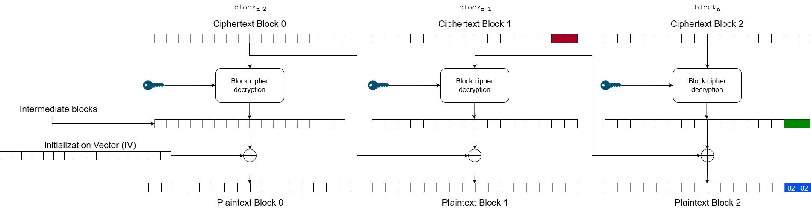

When using AES in CBC mode without any integrity checks such as a MAC, it can be possible to leak information about a ciphertext which can lead to full plaintext recovery. Under such circumstances the attacker is able to send arbitrary ciphertexts to be decrypted to an oracle (e.g. application service) and obtain the result of the decryption. If the result indicates that a padding error has occurred, the attacker can use the information to recover the plaintext without knowing the secret key. Furthermore, the attacker can modify a ciphertext such that it decrypts to a defined plaintext, chosen by the attacker. For instance, changing `user=Normal` to `user=Admin`. This is possible because the application service informs the attacker whether a padding error has occurred or not. More about padding in the next section.


## What is padding?
As we learned in [AES Basics](/cryptography/aes_bascis), AES-CBC is a block cipher and requires a fixed length of 128 bits, therefore the final plaintext block may need extra bytes or so called "padding". There exists different padding schemes but the most popular one used is PKCS#7. For example, if a block needs two more bytes in order to be valid (128 bits in size), it will be padded with `\0x2\0x2`. If four bytes are needed, the padding will be `\0x4\0x4\0x4\0x4` and so on. See the table below for more examples *(decimal formatted)*:

```
01
02 02
03 03 03
04 04 04 04
05 05 05 05 05
06 06 06 06 06 06
07 07 07 07 07 07 07
08 08 08 08 08 08 08 08
09 09 09 09 09 09 09 09 09
10 10 10 10 10 10 10 10 10 10
11 11 11 11 11 11 11 11 11 11 11
12 12 12 12 12 12 12 12 12 12 12 12
13 13 13 13 13 13 13 13 13 13 13 13 13
14 14 14 14 14 14 14 14 14 14 14 14 14 14
15 15 15 15 15 15 15 15 15 15 15 15 15 15 15
16 16 16 16 16 16 16 16 16 16 16 16 16 16 16 16 <-- Block full of padding
```

If a ciphertext contains an incorrect padding, the decryption will most likely fail and produce an error. If you can observe this error, either through an error message or measuring application response times, then you can recover a given ciphertext without knowledge about the private key. This is why it is called a padding oracle attack, because you ask the oracle if the padding is correct or not. This is quite a severe information leak. The next section describes how to perform the attack.

## Performing the attack

Because the service *(oracle)* returns whether a ciphertext is correctly padded or not, we can continuously send modified ciphertext to recover the intermediate bytes produced by the AES algorithm thus decrypting the ciphertext.



The above image contains three blocks, each containing 16 bytes. Each block's decryption/encryption output is XORed with the previous block's ciphertext. Thus, in order to control the output of ciphertext block 2, we need to modify ciphertext block 1.

The attack is performed by modifying the last byte (red) in ciphertext block 1. The modified byte will eventually be XORed with last byte (green) in the final intermediate block. The result of this XOR operation should result in the correct plaintext byte, however in our case we want the result to become `\0x01`, indicating a padding of size `1` which should decrypt correctly *(even though the output may be corrupted)*. Therefore, if `red ^ green = 0x1` then we can simply perform `0x1 ^ red = green` in order to recover the intermediate byte (the green value). Once this value has been revealed, we can recover the last plaintext byte in plaintext block 2 by `green ^ C1_16 = P2_16` where `C1_16` is the sixteenth byte in ciphertext block 1 (red). We can express this mathematically:


$$ I_{16_{block_{n}}} \otimes C_{16_{block_{n-1}}} = P_{16_{block_{n}}}$$

In summary, the attack is simply to brute force all values between 00-ff (0-255) such that the result successfully decrypts. If so, the intermediate byte value has been found and then it is trivial to recover the corresponding plaintext byte.

Once the last byte of $block_\{n-1\}$ has been recovered, it's time to move to the second to last byte. Now the goal is to set the padding to `\0x02\0x02`. This can be visualized in the image below:



If successful then the second to last intermediate byte has been found and the plaintext byte can be recovered. Next step is to set the padding to `\0x03\0x03\0x03` and so on until you have gone through all bytes. Then the same process is repeated but for $block_\{n-2\}$ or ciphertext block 0 in images above.

You may wonder how we should recover plaintext block 0 if there are no previous ciphertext blocks. If you know the IV (which should be public) then you can simply re-arrange the blocks in such a way that the IV block appears first, i.e `[IV][BLOCK_0][BLOCK_1][BLOCK_2]`. Now it is possible to recover plaintext block 0 by modifying the IV block like before. If the IV is not known, then you can try setting the IV block to all 0s, 1s or any other default value you can think of. If that doesn't work then you can't recover the first block, but that is OK in most cases. 

## Already padded messages

TBA

## How to prevent

The main issue with padding oracles is the fact that the attacker can tell whether a padding error occurred or not. If attacker can not deduce this information, the attack will most likely fail. However hiding error messages does not remove the vulnerability. A better approach would be to upgrade to AES-GCM or add a message authentication code such as HMAC to the ciphertext. As a result, when the ciphertext is created, the encryption function computes the hash of the ciphertext and embeds it into the encrypted message. For instance, the final ciphertext can be visualized as `[HMAC][CIPHERTEXT]`.

Before decrypting, the decryption function will first compute the hash of the `[CIPHERTEXT]` and compare it to `[HMAC]`. If equal, the integrity check has succeeded. If it failed, decryption should not be attempted. This method is also sometimes called *Encrypt-Then-Mac*.

Don't underestimate information leaks!

## Exercises

Download the file `hack.py` attached to this article. Fire up the server and run the script. You should be presented with the following message after a few seconds:

```
essage by mikey, the most impressive hacker the gibson has seen
```

Nice, you recovered the majority of the plaintext. But you missed the first block, can you recover it? The code contains everything you need in order to continue.

If you believe you have recovered block 0, you can verify with the hash below:

```
$ echo -n "<block_0>" | shasum -a 256
3c8d770904f2248b6661b99f1ef0d1e18cb6d4a417c594904e950f45bcce9ee7  -
```